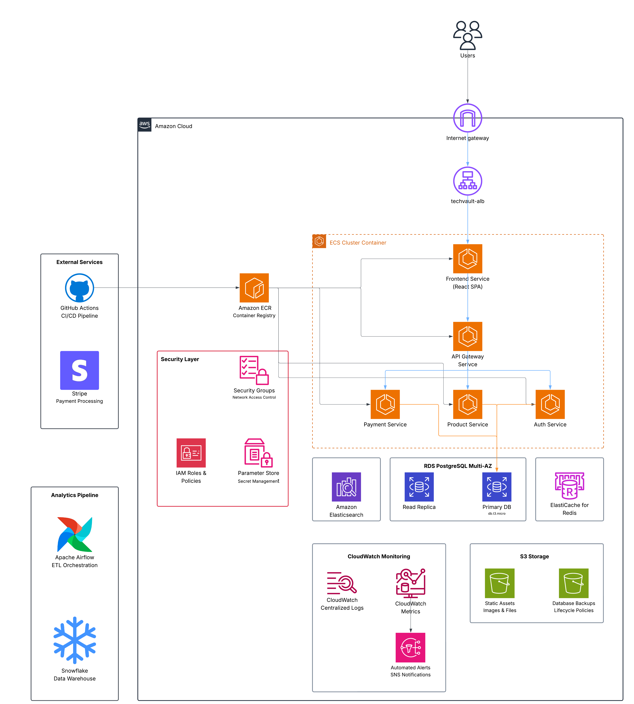

# TechVault - Cloud-Native E-commerce Platform

**TechVault** is a cloud-native, microservices-based e-commerce platform specializing in premium electronics. Built with modern DevOps practices, it demonstrates enterprise-grade architecture patterns including containerized microservices, Infrastructure as Code, and CI/CD automation.

## Architecture Overview



*Cloud-native microservices architecture on AWS ECS Fargate with comprehensive monitoring and cost optimization.*

## Technology Stack

- **Frontend**: React 18 + TypeScript, Vite
- **Backend**: Node.js Gateway, Python/Flask + Go/Gin microservices  
- **Infrastructure**: AWS ECS Fargate, RDS PostgreSQL, Redis, Elasticsearch
- **DevOps**: Terraform, GitHub Actions, CloudWatch monitoring
- **Analytics**: Apache Airflow + Snowflake ETL pipeline

## Key Features

### Infrastructure & DevOps
- **Modular Terraform**: 6 specialized modules with multi-environment support
- **Cost Optimized**: Three deployment tiers (Free tier ~$47/month, Production ~$340/month)
- **Service-Specific CI/CD**: Individual GitHub Actions pipelines for each microservice
- **Container Orchestration**: ECS Fargate with auto-scaling and blue/green deployments
- **Comprehensive Monitoring**: CloudWatch logging, metrics, alarms, and dashboards

### Application Features
- **Public Access**: Browse products, view details, guest cart functionality
- **Authenticated Features**: User accounts, persistent cart, secure checkout, order tracking
- **Microservices**: Independent services for auth, products, cart, payment, orders
- **Search & Analytics**: Elasticsearch product search, Airflow ETL pipelines

## Quick Start

### Prerequisites
- Docker and Docker Compose
- Node.js 18+ and Python 3.11+ (for development)

### Local Development
```bash
git clone https://github.com/rotimiAbiola/TechVault.git
cd TechVault
docker compose up --build
```

**Service URLs:**
- Frontend: http://localhost:3000
- API Gateway: http://localhost:5000
- Health Check: http://localhost:5000/health

## Project Structure
```
├── frontend/                 # React TypeScript frontend
├── gateway/                  # API Gateway service
├── auth-service/            # Authentication microservice
├── product-service/         # Product catalog microservice
├── cart-service/            # Shopping cart microservice
├── payment-service/         # Payment processing microservice
├── order-service/           # Order management microservice
├── terraform/               # Infrastructure as Code
├── .github/workflows/       # CI/CD pipelines
└── aws/task-definitions/    # ECS deployment configs
```

## Core API Endpoints

### Authentication
- `POST /api/register` - User registration
- `POST /api/login` - User login
- `GET /api/profile` - Get/update user profile

### Products (Public)
- `GET /api/products` - List products with pagination
- `GET /api/products/{id}` - Product details
- `GET /api/products/categories` - Product categories

### Cart & Orders
- `GET/POST/PUT/DELETE /api/cart/*` - Cart management
- `GET/POST /api/orders` - Order creation and history
- `POST /api/payment/*` - Payment processing

## Production Deployment

**Infrastructure**: Terraform modules for VPC, Security, Database, ECS, Storage, Monitoring
**CI/CD**: GitHub Actions with service-specific pipelines
**Monitoring**: CloudWatch logging, metrics, alarms, and dashboards
**Security**: JWT authentication, container security, secrets management

## Documentation

- **[Task Definitions](aws/task-definitions/README.md)** - ECS deployment configuration
- **[Development Scripts](scripts/README.md)** - Local development utilities
