```mermaid
graph TB
    %% External Users
    Users[👥 Users<br/>Web Browsers]
    
    %% AWS Cloud
    subgraph AWS["🌐 AWS Cloud - Production Environment"]
        %% Internet Gateway & Load Balancer
        IGW[Internet Gateway]
        ALB[🔄 Application Load Balancer<br/>techvault-production-alb]
        
        %% VPC and Availability Zones
        subgraph VPC["🏢 VPC (10.0.0.0/16)"]
            subgraph AZ1["📍 Availability Zone 1a"]
                PubSub1[Public Subnet<br/>10.0.1.0/24]
                PrivSub1[Private Subnet<br/>10.0.101.0/24]
            end
            
            subgraph AZ2["📍 Availability Zone 1b"]
                PubSub2[Public Subnet<br/>10.0.2.0/24]
                PrivSub2[Private Subnet<br/>10.0.102.0/24]
            end
            
            %% NAT Gateway/Instance
            NAT[🌉 NAT Gateway/Instance<br/>Internet Access for Private]
        end
        
        %% ECS Fargate Cluster
        subgraph ECS["🐳 ECS Fargate Cluster - techvault-production"]
            subgraph Frontend["⚛️ Frontend Service"]
                FrontendTasks[React SPA<br/>Port 3000<br/>CPU: 256, Memory: 512MB]
            end
            
            subgraph Gateway["🚪 API Gateway Service"]
                GatewayTasks[Flask Gateway<br/>Port 5000<br/>Request Routing]
            end
            
            subgraph AuthSvc["🔐 Auth Service"]
                AuthTasks[Flask Auth<br/>Port 5001<br/>JWT & User Mgmt]
            end
            
            subgraph ProductSvc["📱 Product Service"]
                ProductTasks[Go Service<br/>Port 5002<br/>Catalog & Search]
            end
            
            subgraph PaymentSvc["💳 Payment Service"]
                PaymentTasks[Flask Payment<br/>Port 5003<br/>Stripe Integration]
            end
        end
        
        %% Databases
        subgraph RDS["🗄️ RDS PostgreSQL Multi-AZ"]
            PrimaryDB[(Primary DB<br/>db.t3.micro)]
            ReplicaDB[(Read Replica<br/>Analytics)]
        end
        
        %% Cache Layer
        subgraph ElastiCache["⚡ ElastiCache Redis"]
            RedisCluster[(Redis Cluster<br/>cache.t3.micro<br/>Sessions & Cache)]
        end
        
        %% Search Engine
        subgraph OpenSearch["🔍 OpenSearch Cluster"]
            SearchCluster[(OpenSearch<br/>t3.small.search<br/>Product Search)]
        end
        
        %% Storage
        subgraph S3["📦 S3 Storage"]
            AssetsBucket[Static Assets<br/>Images & Files]
            BackupBucket[Database Backups<br/>Lifecycle Policies]
        end
        
        %% Monitoring
        subgraph CloudWatch["📊 CloudWatch Monitoring"]
            Logs[Centralized Logs<br/>All Services]
            Metrics[Custom Metrics<br/>Business & Technical]
            Alarms[Automated Alerts<br/>SNS Notifications]
            Dashboard[Operational Dashboard<br/>Real-time Metrics]
        end
        
        %% Security
        subgraph Security["🛡️ Security Layer"]
            IAM[IAM Roles & Policies<br/>Service Authentication]
            Secrets[Parameter Store<br/>Secrets Management]
            SecurityGroups[Security Groups<br/>Network Access Control]
        end
    end
    
    %% External Services
    subgraph External["🌍 External Services"]
        Stripe[💰 Stripe<br/>Payment Processing]
        ECR[📦 Amazon ECR<br/>Container Registry]
        Github[⚙️ GitHub Actions<br/>CI/CD Pipeline]
    end
    
    %% Analytics & ETL
    subgraph Analytics["📈 Analytics Pipeline"]
        Airflow[🔄 Apache Airflow<br/>ETL Orchestration]
        Snowflake[❄️ Snowflake<br/>Data Warehouse]
    end
    
    %% Connections
    Users --> IGW
    IGW --> ALB
    ALB --> Frontend
    ALB --> Gateway
    
    Gateway --> AuthSvc
    Gateway --> ProductSvc
    Gateway --> PaymentSvc
    
    Frontend -.-> Gateway
    
    AuthSvc --> PrimaryDB
    ProductSvc --> PrimaryDB
    PaymentSvc --> PrimaryDB
    
    AuthSvc --> RedisCluster
    ProductSvc --> RedisCluster
    Gateway --> RedisCluster
    
    ProductSvc --> SearchCluster
    
    PaymentSvc --> Stripe
    
    Frontend --> AssetsBucket
    PrimaryDB --> BackupBucket
    
    %% Monitoring connections
    ECS -.-> Logs
    RDS -.-> Metrics
    ElastiCache -.-> Metrics
    Metrics --> Alarms
    Alarms --> Dashboard
    
    %% CI/CD connections
    Github --> ECR
    ECR --> ECS
    
    %% Analytics connections
    PrimaryDB --> Airflow
    Airflow --> Snowflake
    ReplicaDB --> Airflow
    
    %% Security connections
    ECS -.-> IAM
    ECS -.-> Secrets
    SecurityGroups -.-> ECS
    SecurityGroups -.-> RDS
    SecurityGroups -.-> ElastiCache
    
    %% Network flow
    PubSub1 --> NAT
    PubSub2 --> NAT
    NAT --> IGW
    PrivSub1 --> NAT
    PrivSub2 --> NAT
    
    %% Styling
    classDef aws fill:#FF9900,stroke:#232F3E,stroke-width:2px,color:#fff
    classDef compute fill:#FF9900,stroke:#232F3E,stroke-width:2px,color:#fff
    classDef database fill:#4285F4,stroke:#1a73e8,stroke-width:2px,color:#fff
    classDef cache fill:#DC382D,stroke:#b71c1c,stroke-width:2px,color:#fff
    classDef storage fill:#0F9D58,stroke:#137333,stroke-width:2px,color:#fff
    classDef monitor fill:#9C27B0,stroke:#7B1FA2,stroke-width:2px,color:#fff
    classDef security fill:#795548,stroke:#5D4037,stroke-width:2px,color:#fff
    classDef external fill:#607D8B,stroke:#455A64,stroke-width:2px,color:#fff
    classDef users fill:#E91E63,stroke:#C2185B,stroke-width:2px,color:#fff
    
    class Users users
    class AWS,VPC,AZ1,AZ2 aws
    class ECS,Frontend,Gateway,AuthSvc,ProductSvc,PaymentSvc compute
    class RDS,PrimaryDB,ReplicaDB database
    class ElastiCache,RedisCluster cache
    class S3,AssetsBucket,BackupBucket storage
    class CloudWatch,Logs,Metrics,Alarms,Dashboard monitor
    class Security,IAM,Secrets,SecurityGroups security
    class External,Stripe,ECR,Github,Analytics,Airflow,Snowflake external
```

# TechVault Production Architecture

This diagram illustrates the complete production architecture for TechVault running on AWS ECS Fargate.

## Architecture Highlights

### 🏗️ **Infrastructure Layer**
- **Multi-AZ Deployment**: High availability across 2 availability zones
- **VPC Network**: Isolated 10.0.0.0/16 network with public/private subnet separation
- **Load Balancing**: Application Load Balancer with SSL termination and health checks

### 🐳 **Container Platform**
- **ECS Fargate**: Serverless container execution with auto-scaling
- **Microservices**: 5 independent services with dedicated task definitions
- **Service Mesh**: Internal service discovery and communication

### 🗄️ **Data Layer**
- **RDS PostgreSQL**: Multi-AZ primary database with read replicas
- **ElastiCache Redis**: In-memory caching and session management
- **OpenSearch**: Full-text search for product catalog
- **S3 Storage**: Static assets and automated backups

### 📊 **Observability**
- **CloudWatch**: Centralized logging, metrics, and dashboards
- **Custom Metrics**: Business KPIs and technical performance indicators
- **Automated Alerting**: SNS notifications for critical events

### 🛡️ **Security**
- **IAM Integration**: Service-to-service authentication
- **Parameter Store**: Encrypted secrets management
- **Security Groups**: Network-level access control

### 🔄 **CI/CD & DevOps**
- **GitHub Actions**: Automated build, test, and deployment pipelines
- **Amazon ECR**: Container image registry with vulnerability scanning
- **Blue/Green Deployments**: Zero-downtime deployments with rollback capability

### 📈 **Analytics Pipeline**
- **Apache Airflow**: ETL orchestration for business analytics
- **Snowflake Integration**: Data warehousing for advanced analytics
- **Real-time Dashboards**: Business intelligence and operational metrics

## Cost Optimization

The architecture supports multiple deployment configurations:
- **Free Tier**: ~$47/month with NAT instance and smaller resources
- **Development**: ~$57/month with enhanced monitoring
- **Production**: ~$340/month with full redundancy and scaling

This production-ready architecture demonstrates enterprise-grade patterns while maintaining cost efficiency and operational excellence.
